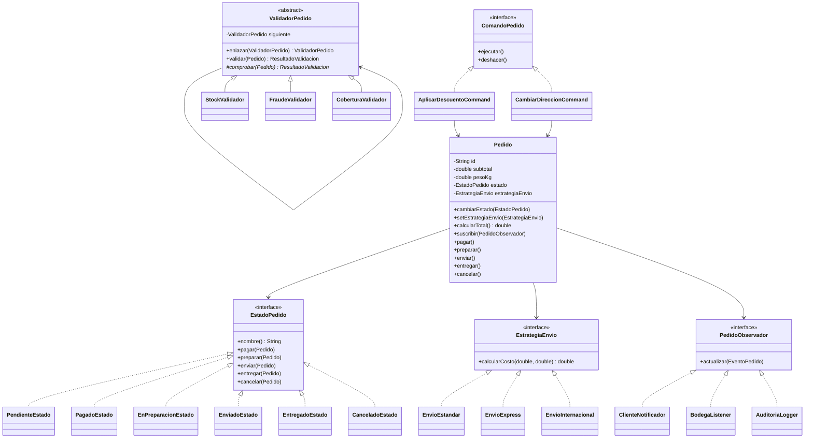

# Diagrama de Clases UML - UNIAJC Logistics

```mermaid
classDiagram
    class Pedido {
        -String id
        -double subtotal
        -double pesoKg
        -EstadoPedido estado
        -EstrategiaEnvio estrategiaEnvio
        +cambiarEstado(EstadoPedido)
        +setEstrategiaEnvio(EstrategiaEnvio)
        +calcularTotal() double
        +suscribir(PedidoObservador)
        +pagar()
        +preparar()
        +enviar()
        +entregar()
        +cancelar()
    }

    class EstadoPedido {
        <<interface>>
        +nombre() String
        +pagar(Pedido)
        +preparar(Pedido)
        +enviar(Pedido)
        +entregar(Pedido)
        +cancelar(Pedido)
    }

    class PendienteEstado
    class PagadoEstado
    class EnPreparacionEstado
    class EnviadoEstado
    class EntregadoEstado
    class CanceladoEstado

    class EstrategiaEnvio {
        <<interface>>
        +calcularCosto(double, double) double
    }

    class EnvioEstandar
    class EnvioExpress
    class EnvioInternacional

    class ValidadorPedido {
        <<abstract>>
        -ValidadorPedido siguiente
        +enlazar(ValidadorPedido) ValidadorPedido
        +validar(Pedido) ResultadoValidacion
        #comprobar(Pedido)* ResultadoValidacion
    }

    class StockValidador
    class FraudeValidador
    class CoberturaValidador

    class PedidoObservador {
        <<interface>>
        +actualizar(EventoPedido)
    }

    class ClienteNotificador
    class BodegaListener
    class AuditoriaLogger

    class ComandoPedido {
        <<interface>>
        +ejecutar()
        +deshacer()
    }

    class AplicarDescuentoCommand
    class CambiarDireccionCommand

    Pedido --> EstadoPedido
    Pedido --> EstrategiaEnvio
    Pedido --> PedidoObservador

    EstadoPedido <|.. PendienteEstado
    EstadoPedido <|.. PagadoEstado
    EstadoPedido <|.. EnPreparacionEstado
    EstadoPedido <|.. EnviadoEstado
    EstadoPedido <|.. EntregadoEstado
    EstadoPedido <|.. CanceladoEstado

    EstrategiaEnvio <|.. EnvioEstandar
    EstrategiaEnvio <|.. EnvioExpress
    EstrategiaEnvio <|.. EnvioInternacional

    ValidadorPedido --> ValidadorPedido
    ValidadorPedido <|-- StockValidador
    ValidadorPedido <|-- FraudeValidador
    ValidadorPedido <|-- CoberturaValidador

    PedidoObservador <|.. ClienteNotificador
    PedidoObservador <|.. BodegaListener
    PedidoObservador <|.. AuditoriaLogger

    ComandoPedido <|.. AplicarDescuentoCommand
    ComandoPedido <|.. CambiarDireccionCommand
    AplicarDescuentoCommand --> Pedido
    CambiarDireccionCommand --> Pedido
```