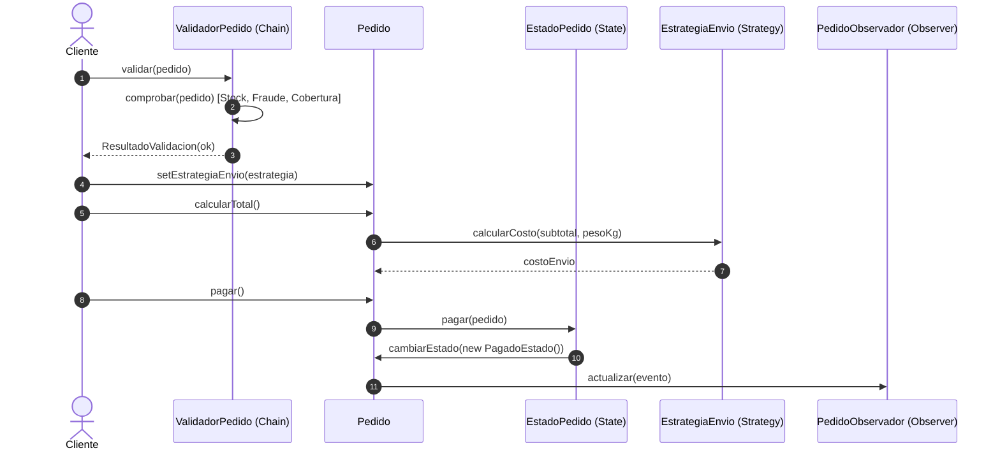

# Diagrama de Secuencia - Procesamiento de Pedido

```mermaid
sequenceDiagram
    autonumber
    actor Cliente
    participant Validador as ValidadorPedido (Chain)
    participant Pedido
    participant Estado as EstadoPedido (State)
    participant Estrategia as EstrategiaEnvio (Strategy)
    participant Obs as PedidoObservador (Observer)

    Cliente->>Validador: validar(pedido)
    Validador->>Validador: comprobar(pedido) [Stock, Fraude, Cobertura]
    Validador-->>Cliente: ResultadoValidacion(ok)

    Cliente->>Pedido: setEstrategiaEnvio(estrategia)
    Cliente->>Pedido: calcularTotal()
    Pedido->>Estrategia: calcularCosto(subtotal, pesoKg)
    Estrategia-->>Pedido: costoEnvio

    Cliente->>Pedido: pagar()
    Pedido->>Estado: pagar(pedido)
    Estado->>Pedido: cambiarEstado(new PagadoEstado())
    Pedido->>Obs: actualizar(evento)
```